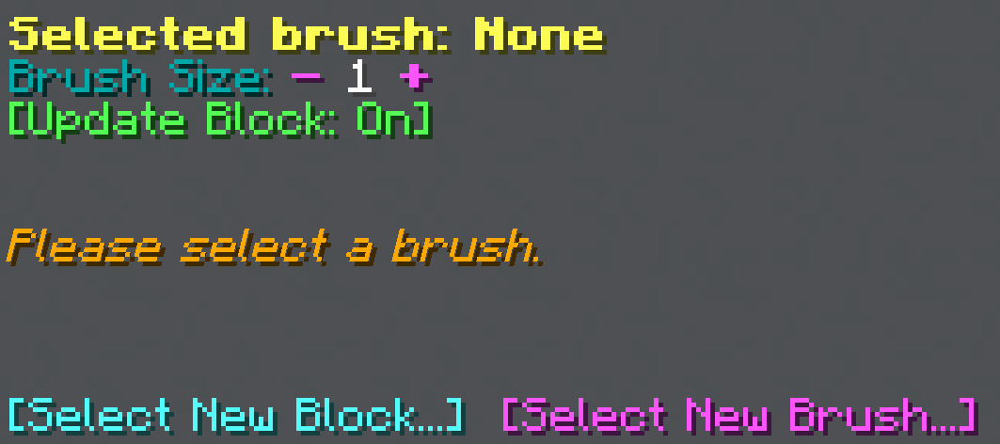
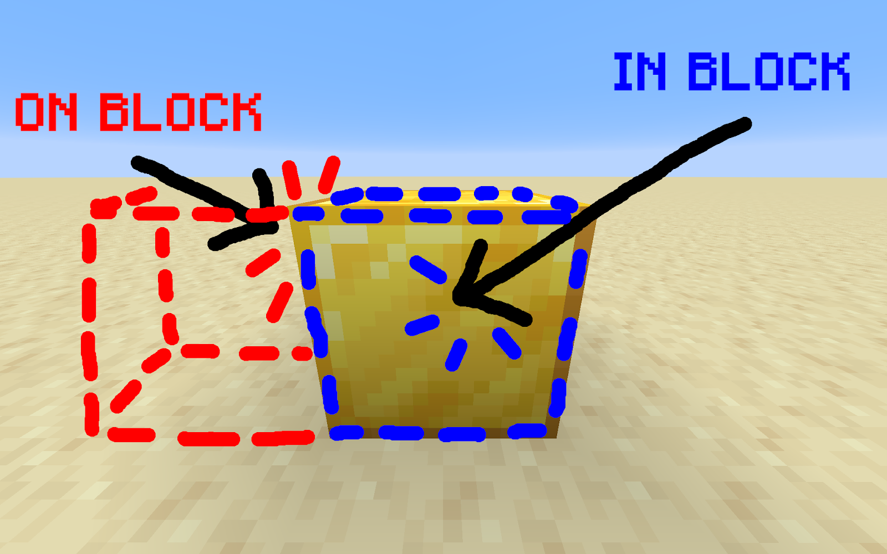
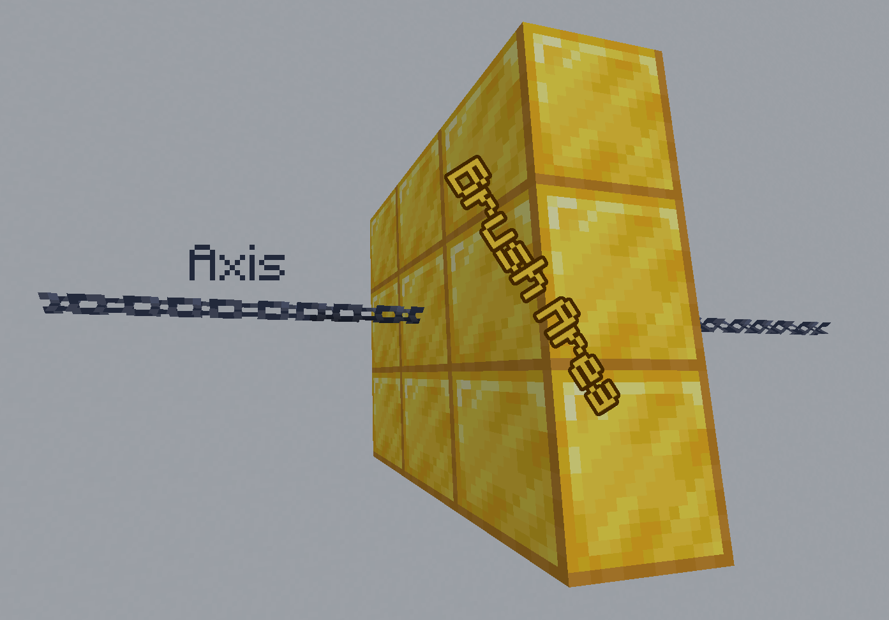

import MCFont from '@site/src/components/minecraft-font'

# Usage

The Brush Tool is used for quick block placement and modification. **Right-click** it to use it. **Drop** it to open its menu.
#

By default, no brush is selected. Use the <MCFont color="green">[Select New Brush...]<MCFont> button to select a brush to use. With most brushes, you can adjust the <MCFont color="#00a8a8">Brush size<MCFont>

:::tip
All settings and brushes set are specific to that brush item. This means you can make multiple brush items with the settings and brushes you need. You can give yourself more brush tools with `/loot give @s loot worldtool:brush_tool`, or you can use the **middle mouse button** on brush tools in the inventory to make copies of them (while in creative mode).
:::

## Brush Options
Each brush has different options that appear in the menu. Some **common brush options** are:
#
* <MCFont color="green">[Update Block]<MCFont> - On or off. Updates the [process block](../technical/processes#stored-blocks) each time the brush is used. This can provide a small speed boost to your brush usage, but you probably want this enabled if you don't want to keep track of what block is currently being stored.
* <MCFont color="blue">[Placement]<MCFont> - "In Block" or "On Block". Decides what block the brush should start from; inside the targeted block or on the targeted block. Here's an image to help explain:  
  
* <MCFont color="dark_purple">[Flat]<MCFont> - On or off. Toggles placing blocks in a flat square area instead of a cubic one. When this option is on, the <MCFont color="gold">Axis<MCFont> option will also appear.
* <MCFont color="gold">Axis<MCFont> - X, Y, Z, or Auto. Appears for brushes that only affect flat areas. Decides with what orientation the brush is placed. Here's an image to help explain:  
    
  Setting it to "Auto" makes it decide which axis to use based on what side of a block you use the brush on.
