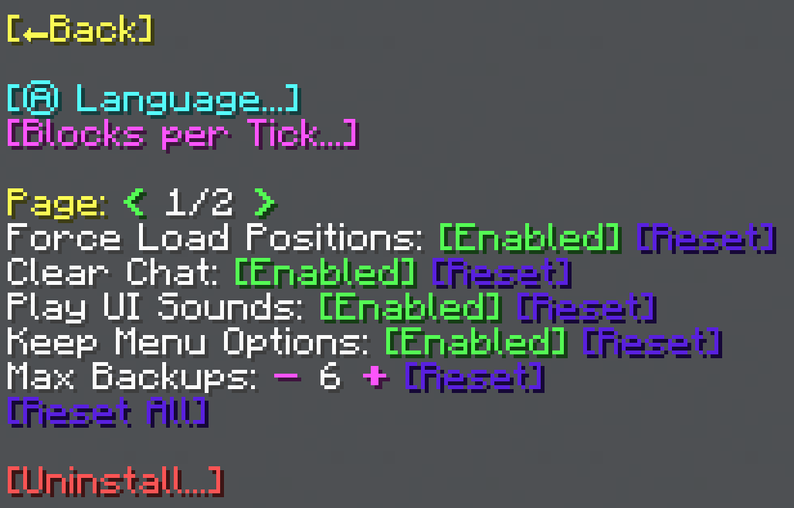

import MCFont from '@site/src/components/minecraft-font'

# Configuration

## Settings

The Settings menu can be reached through the Options menu of either the [General Tool](general-tool/options) or the [Shape Generation Tool](shape-generation-tool/options).

From this menu, you can all the global WorldTool settings. These apply for all players using WorldTool.
#

### Main Settings
The main setting list contains the following settings:
* **Force Load Positions** (Default = true) - If enabled, the General Tool's positions 1 and 2, as well as the randomizer positions 1 and 2, will remain loaded even if not within the chunk load distance.
* **Display Progress Bar** (Default = true) - Toggles a progress bar at the top of the screen while a process is running.
* **Clear Chat** (Default = true) - Toggles clearing the chat between each menu to make the UI more readable.
* **Play UI Sounds** (Default = true) - Controls whether to play clicking and popping sounds while navigating the menu.
* **Display Reload Message** (Default = false) - More of a debug tool. If enabled, a message will be displayed every time WorldTool has been reloaded.
* **Enable Backups** (Default = true) - Enables backups and undo functionality. The reason why this is a toggle is because this functionality is still a bit of a beta version.
* **Keep Menu Options** (Default = true) - If enabled, most options set within General Tool menus will be saved when the menus are closed and reopened. This does, however, cause clutter with tags, in case you care about that.
* **Size Warn Limit** (Default = 100000) - A warning will be displayed if an area of this size or greater is selected with the General Tool. This is to prevent accidental area selections.
* **Log Limit** (Default = 100) - The maximum amount of [log entries](technical/processes#log) to keep.
* **Max Backups** (Default = 6) - The maximum amount of area backups to keep per player. Don't set this value too high, as there is a limit of 1000 total backup slots being used at once.
#
The <MCFont color="#5a20e3">[Reset]</MCFont> buttons next to each option can be used to restore it to its default value.  
The <MCFont color="#5a20e3">[Reset All]</MCFont> button at the bottom of the menu can be used to restore all settings at once to their default values.

### Language
The <MCFont color="aqua">[Language...]</MCFont> button at the top opens a menu that lets you change the language as well as a <MCFont color="yellow">[Reload]</MCFont> option.
#

So far, there is only one language available. You can add a new language yourself by using a [plugin](making-a-plugin/start), but please let me know if you would like to help translate WorldTool, so I can add it to the base data pack.
#
The <MCFont color="yellow">[Reload]</MCFont> option can be used to reload all translations every time the data pack is reloaded.

### Blocks per Tick
The <MCFont color="aqua">[Blocks per Tick...]</MCFont> button at the top opens this menu:
#

In this menu, you can specify a "blocks per tick" value for each [process](technical/processes), which is simply how many blocks the process goes through in a single tick (1 tick = 1/20 seconds). Lowering this value can help with performance.
#
At the top of the menu, you can select a preset to use. The available presets are: `Low`, `Medium`, `High (Default)`, and `Maximum`. If a value for an individual process is adjusted, the preset is set to `Custom`.

## Scores
There are a few adjustable scoreboard values, which can be set with `/scoreboard players set NAME worldtool VALUE`.
#
From most to least commonly useful:
* `$maxRaycastingDistance` (Default = 100) - The maximum distance (in blocks) to look for a block when right-clicking with a tool.
* `$templateSizeLimit` (Default = 48) - Tells WorldTool what the maximum side length of templates (structure files) is. This can be changed if you have a mod installed that allows this value to be higher, or if a future Minecraft version supports bigger templates.
* `$playerInput` (Default = 1 (true)) - Decides if player interfacing is enabled. Disabling this will disable all player interaction with tools, as well disabling particles. Set this to 0 (meaning false) if you're, for example, using WorldTool as a library in a map and don't need any user interaction functionality.
* `$playerdbAvailable` (Default = 1 (true)) - Tells WorldTool if the [PlayerDB library](https://github.com/rx-modules/PlayerDB) is available to use. This controls the availability of undo/redo, copy/paste, and the Clone Template mode.
