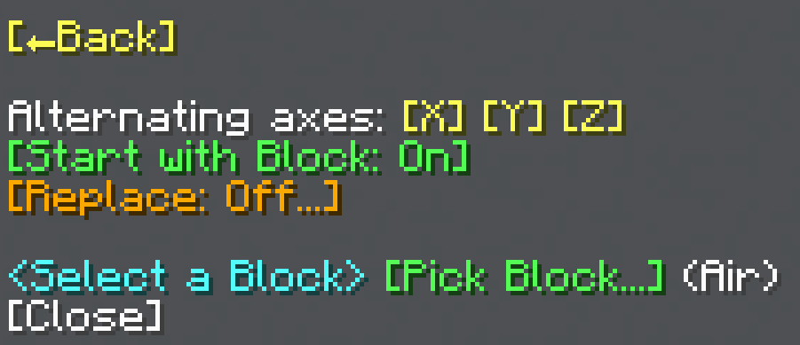

import MCFont from '@site/src/components/minecraft-font'

# Checkered

The Checkered menu can be found with the <MCFont color="#fc03cf">[Checkered...]</MCFont> button in the [main General Tool menu](usage#main-menu). This operation places a block every other block, making a checkered or striped pattern.
#

The [block selection menu](../chat-menu-system#block-selection) at the bottom of the menu starts the Checkered operation once you select a block with it. Selecting a block in the menu the <MCFont color="gold">[Replace...]</MCFont> button opens also starts the opreation.

## Alternating Axes
Through the <MCFont>Alternating axes</MCFont> option, you can change which axes alternate. For example, if only the X axis is selected, the operation will create a striped pattern that alternates along the X axis.

## Start with Block
The <MCFont color="green">[Start with Block]</MCFont> option lets you change whether to start with a block, or wait for the alternation to place a block.

## Replace
The <MCFont color="gold">[Replace...]</MCFont> button opens a menu where you can choose a certain block to replace (<MCFont color="green">[Normal]</MCFont>), or a certain block to *not* replace (<MCFont color="gold">[Exclude]</MCFont>). Selecting a block in this menu starts the Checkered operation.
