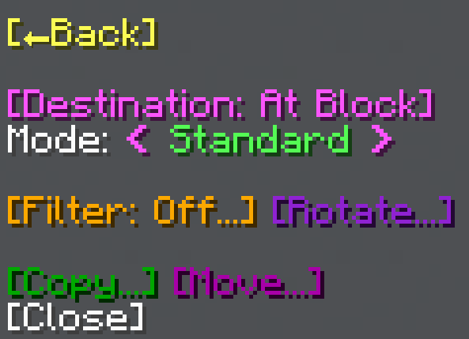
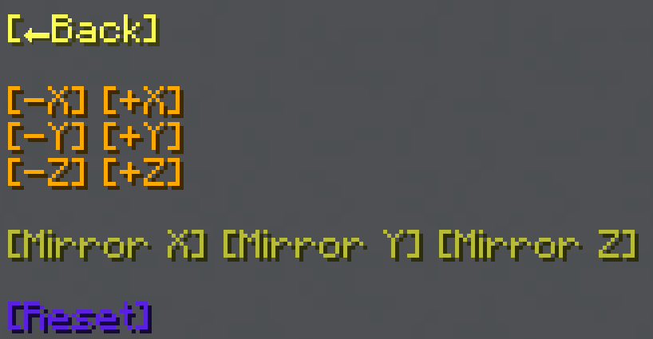
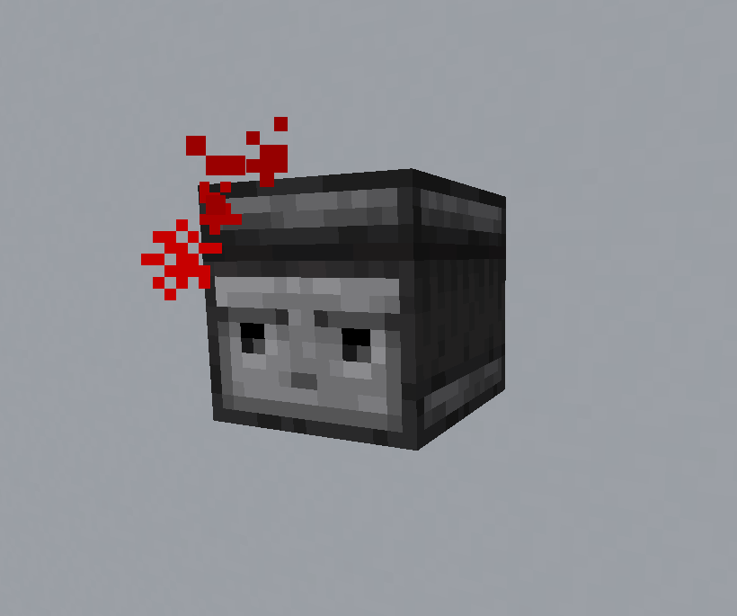

import MCFont from '@site/src/components/minecraft-font'

# Clone

The Clone menu can be found with the <MCFont color="dark_blue">[Clone...]</MCFont> button in the [main General Tool menu](usage#main-menu). This operation allows you to copy or move an area from one place to another.
#

First of all, the <MCFont color="light_purple">[Destination]</MCFont> option lets you toggle between placing the cloned area at a right-clicked block in the world (<MCFont color="light_purple">At Block</MCFont>) and placing the cloned area at your player position (<MCFont color="light_purple">At Player</MCFont>).

## Modes
The <MCFont>Mode</MCFont> option allows you to choose between two different cloning modes.
#
<MCFont color="green">Standard</MCFont>, the default mode, includes all rotation and filter functionality, but does not rotate individual blocks properly. For example, stairs facing one way still face the same way after being rotated.  
The <MCFont color="green">Template</MCFont> mode is faster, and rotates individual blocks properly, unlike the other mode. However, the area can only be rotated around the Y axis and mirrored on one the X or Z axes, and the filter functionality is not supported.

## Filter
The <MCFont color="gold">[Filter]</MCFont> option lets you enable a filter to either only clone a certain block (<MCFont color="green">[Normal]</MCFont>), or clone all blocks except a certain block (<MCFont color="gold">[Exclude]</MCFont>). Once enabled, the filter can be disabled by clicking the button again.

## Rotating
This rotation menu can be opened through the <MCFont color="#9122d6">[Rotate...]</MCFont> button.  

:::danger
update this image
:::

This is what the menu looks like with the full rotation availability of the <MCFont color="green">Standard</MCFont> [cloning mode](#modes).
#
In this rotation menu, you can change the rotation in 90° steps and toggle mirroring on the different axes.

Once the menu has been opened, this **rotation helper** shows up in front of you:  

This serious-looking little buddy helps you by turning its head according to the rotation and mirror axes you select. The red dot shows the **starting position**, which is where the rotation helper faces when there's no rotation active.
#
To reset all rotation, you can use the <MCFont color="#5a20e3">[Reset]</MCFont> button at the bottom of the menu.
