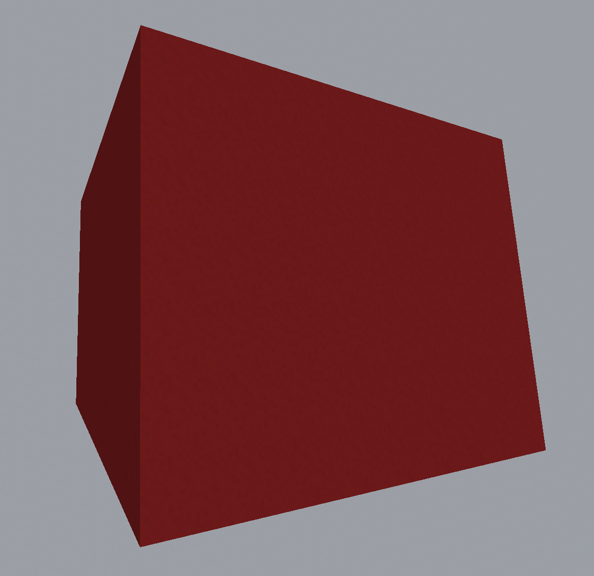
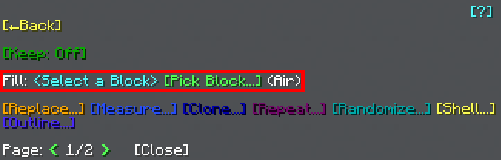

# Fill

Filling is the primary operation for the General Tool. It's the first thing in the General Tool's [main menu](usage#main-menu):  

Pretty simple, really. It's just a [block selection menu](../chat-menu-system#block-selection). Once you've selected a block, the area will be filled with your chosen block.
