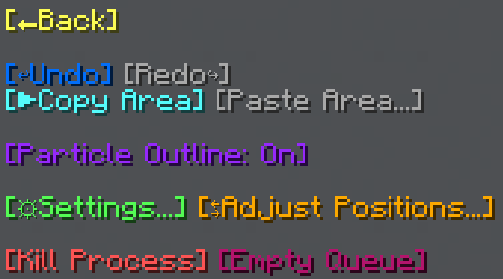

import MCFont from '@site/src/components/minecraft-font'

# Options

The options menu:  

The options menu can be reached with the <MCFont color="aqua">[Options...]</MCFont> button in this menu:  

## Undo and Redo

The first features of this menu are the <MCFont color="#036ffc">[↩Undo]</MCFont> and <MCFont color="#7c2bff">[Redo↪]</MCFont> buttons.

Pretty self-explanatorily, these will undo or redo the changes you've made using WorldTool's tools. [<u>Technical details</u>](../technical/area-storage-system)

:::caution backups
The backups that are used for the <MCFont color="#036ffc">[↩Undo]</MCFont> and <MCFont color="#7c2bff">[Redo↪]</MCFont> functionality **will be lost** if the data pack is reloaded by either using `/reload` or restarting the world.
:::

## Copy and Paste

The <MCFont color="aqua">[▶Copy Area]</MCFont> and <MCFont color="#06c248">[Paste Area...]</MCFont> buttons allow you to save a copy of the currently selected area and paste it elsewhere.
#
When pressing the <MCFont color="#06c248">[Paste Area...]</MCFont> button, this menu will show up:  

Here, you can choose where to paste the area. If you have particles enabled, you'll see a box showing you how the area will be pasted, relative to your current position.

<MCFont color="aqua">[▶Paste at Position 1]</MCFont> pastes the area at your selected first position.  
<MCFont color="yellow">[▶Paste Here]</MCFont> pastes the area at your player position.  
<MCFont color="green">[Select New Position...]</MCFont> allows you to right-click with the General Tool wherever you want to paste the area.

## Particle Outline

The <MCFont color="#9729ff">[Particle Outline]</MCFont> option toggles whether to show particles to help with highlighting your selected area, and many more things. These particles are **only visible to you**.

## Settings

Main page: [Settings](../settings/main)

## Adjust Positions

The Adjust Positions menu allows you to nudge or set one or both positions.  

At the top of the menu, the current positions of corners 1 and 2 are displayed.

