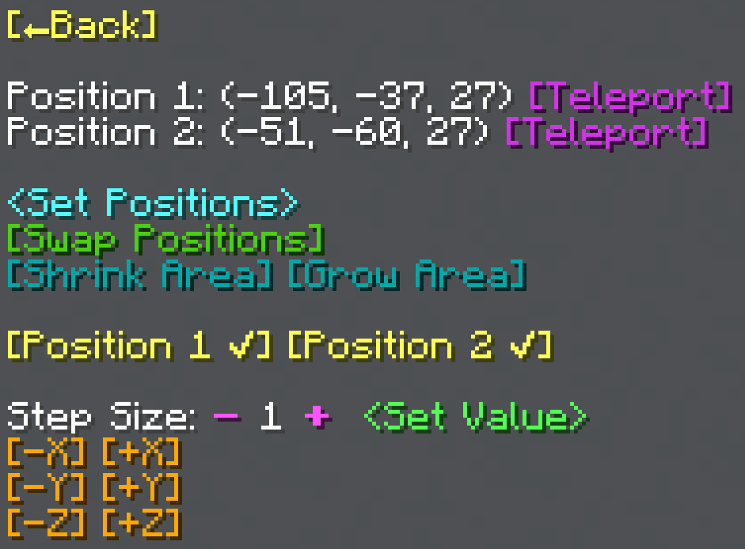

import MCFont from '@site/src/components/minecraft-font'

# Options

The Options menu can be reached with the <MCFont color="aqua">[Options...]</MCFont> button in the [General Tool's initial menu](usage#initial-menu).
#
The Options menu:  

## Undo and Redo

The first features of this menu are the <MCFont color="#036ffc">[↩Undo]</MCFont> and <MCFont color="#7c2bff">[Redo↪]</MCFont> buttons.

Pretty self-explanatorily, these undo or redo the changes you've made using WorldTool's tools.

:::info backups
The backups that are used for the <MCFont color="#036ffc">[↩Undo]</MCFont> and <MCFont color="#7c2bff">[Redo↪]</MCFont> functionality **will be lost** if the data pack is reloaded by either using the `/reload` command or restarting the world.
:::

:::tip
Don't rely on undoing, be careful with your actions.
:::

## Copy and Paste

The <MCFont color="aqua">[▶Copy Area]</MCFont> and <MCFont color="#06c248">[Paste Area...]</MCFont> buttons allow you to save a copy of the currently selected area and paste it elsewhere. This copy **will be deleted** if the data pack is reloaded by either using the `/reload` command or restarting the world.
#
When pressing the <MCFont color="#06c248">[Paste Area...]</MCFont> button, this menu is opened:  

Here, you can choose where to paste the area. If you have particles enabled, you see a box showing you how the area will be pasted, relative to your current position.

<MCFont color="aqua">[▶Paste at Position 1]</MCFont> pastes the area at your selected first position.  
<MCFont color="yellow">[▶Paste Here]</MCFont> pastes the area at your player position.  
<MCFont color="green">[Select New Position...]</MCFont> allows you to right-click with the General Tool wherever you want to paste the area.

## Particle Outline

The <MCFont color="#9729ff">[Particle Outline]</MCFont> option toggles whether to show particles to help with highlighting your selected area, and many more things. These particles are **only visible to you**.

## Settings

Main page: [Settings](../configuration).

## Adjust Positions

The Adjust Positions menu allows you to nudge or set one or both positions.  

At the top of the menu, the current positions 1 and 2 are displayed.

The <MCFont color="aqua">&lt;Set Positions&gt;</MCFont> button opens a menu prompt that allows you to manually set both positions at once.

<MCFont color="#4cd10f">[Swap Positions]</MCFont> swaps both positions, in case you need that.

### Nudging
The <MCFont color="yellow">[Position 1]</MCFont> and <MCFont color="yellow">[Position 2]</MCFont> buttons toggle nudging each position. You can choose to nudge both positions 1 and 2, or only one of them.
#
<MCFont color="gold">[-X]</MCFont><MCFont color="gold">[+X]</MCFont>  
<MCFont color="gold">[-Y]</MCFont><MCFont color="gold">[+Y]</MCFont>  
<MCFont color="gold">[-Z]</MCFont><MCFont color="gold">[+Z]</MCFont>  
Using these buttons moves the positions selected with the <MCFont color="yellow">[Position 1]</MCFont> and <MCFont color="yellow">[Position 2]</MCFont> toggle buttons accordingly.

## Kill Process

The <MCFont color="red">[Kill Process]</MCFont> button kills the currently running process, if there is one. Main page: [Processes](../technical/processes).
