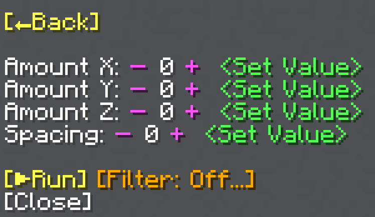

import MCFont from '@site/src/components/minecraft-font'

# Repeat

The Repeat menu can be found with the <MCFont color="#73086a">[Repeat...]</MCFont> button in the [main General Tool menu](usage#main-menu). This operation allows you to make multiple copies of one area and space them out in a grid or line.
#

## Amounts
The <MCFont>Amount</MCFont> options at the top let you set how many copies to make on each axis. These values **can be negative**, which makes them go the opposite direction.

## Spacing
The <MCFont>Spacing</MCFont> option lets you choose how many blocks to leave between each copy.

## Filter
The <MCFont color="gold">[Filter]</MCFont> option lets you enable a filter to either only copy a certain block (<MCFont color="green">[Normal]</MCFont>), or copy all blocks except a certain block (<MCFont color="gold">[Exclude]</MCFont>). Once enabled, the filter can be disabled by clicking the button again.
