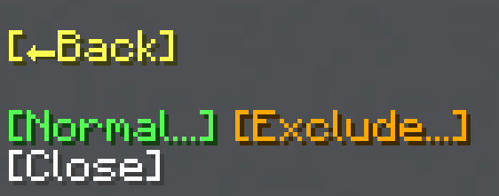

import MCFont from '@site/src/components/minecraft-font'

# Replace

The Replace menu can be found with the <MCFont color="gold">[Replace...]</MCFont> button in the [main General Tool menu](usage#main-menu). It simply replaces all of the specified block(s) that can be found in the area with another block.
#

The first page of the Replace menu looks like this. Here, you can choose whether to select a certain block to replace (<MCFont color="green">[Normal]</MCFont>), or a certain block to *not* replace (<MCFont color="gold">[Exclude]</MCFont>).
#
The next pages are simple [block selection menus](../chat-menu-system#block-selection). On the 2nd page, you choose which block to replace (or not replace), and lastly, on the 3rd page, you choose which block to replace with. After the block has been chosen in the 3rd page, the operation will start.

:::info keep compatibility
Seeing as this operation replaces blocks with other blocks, the <MCFont color="#0aad02">[Keep]</MCFont> option, which normally makes the operation only replace blocks such as air or water, has no effect on it.
:::
