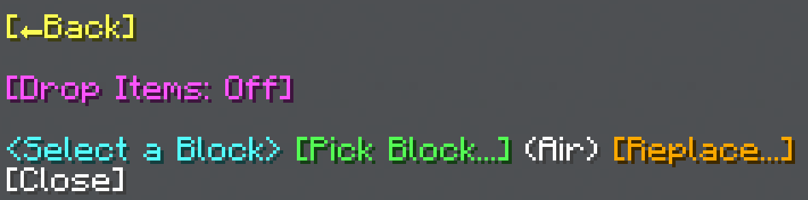

import MCFont from '@site/src/components/minecraft-font'

# Shatter

The Shatter menu can be found with the <MCFont color="red">[Shatter...]</MCFont> button in the [main General Tool menu](usage#main-menu). This operation breaks blocks, causing particles and sound.
#

The [block selection menu](../chat-menu-system#block-selection) at the bottom of the menu starts the Shatter operation once you select a block with it. Selecting a block in the menu the <MCFont color="gold">[Replace...]</MCFont> button opens also starts the opreation.

## Drop Items
The <MCFont color="light_purple">[Drop Items]</MCFont> option toggles whether to drop items from shattered blocks.

## Replace
The <MCFont color="gold">[Replace...]</MCFont> button opens a menu where you can choose a certain block to replace (<MCFont color="green">[Normal]</MCFont>), or a certain block to *not* replace (<MCFont color="gold">[Exclude]</MCFont>). Selecting a block in this menu starts the Shatter operation.

­  
:::info keep compatibility
Seeing as this operation removes existing blocks, the <MCFont color="#0aad02">[Keep]</MCFont> option, which normally makes the operation only replace blocks such as air or water, has no effect on it.
:::
