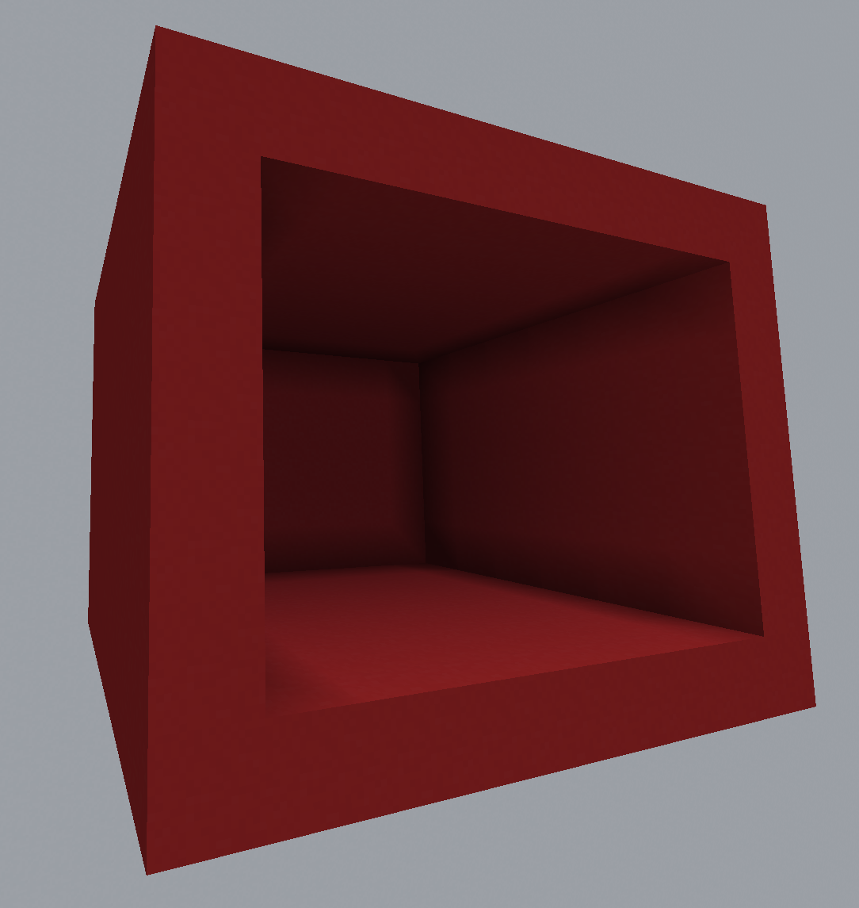
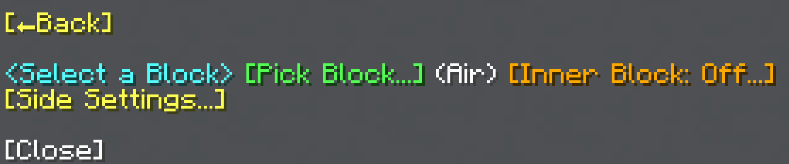
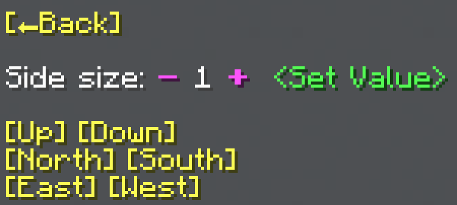

import MCFont from '@site/src/components/minecraft-font'

# Shell

The Shell menu can be found with the <MCFont color="yellow">[Shell...]</MCFont> button in the [main General Tool menu](usage#main-menu). This operation creates blocks around the area's sides.
#

The [block selection menu](../chat-menu-system#block-selection) at the start of the menu starts the Shell operation once you select a block with it.

## Inner Block
The <MCFont color="gold">[Inner Block]</MCFont> option lets you select a block to fill the inside of the area with. Once this option is on, you can use the button again to turn it off.

## Side Settings
The <MCFont color="yellow">[Side Settings...]</MCFont> button opens a menu that lets you change the how many blocks thick each side is, as well as what sides to place.
#

