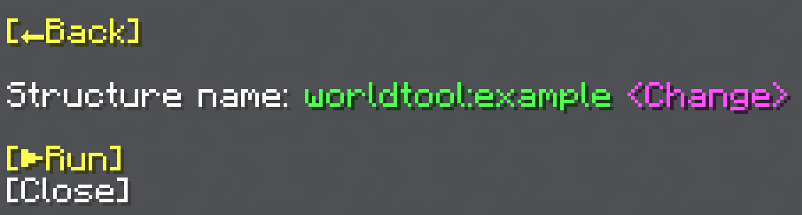

import MCFont from '@site/src/components/minecraft-font'

# Structure Corners

The Structure Corners menu can be found with the <MCFont color="#3a2ffa">[Structure Corners...]</MCFont> button in the [main General Tool menu](usage#main-menu). This operation places two structure blocks in corner mode outside the corners of the selected area, that can be used to quickly save an area as a structure.
#

:::info
This operation **cannot be undone**, as it does not use a [process](../technical/processes).
:::

## Structure Name
Use the <MCFont color="light_purple">&lt;Change&gt;</MCFont> button to change which structure name to use.
