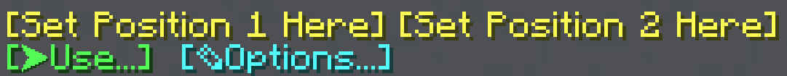
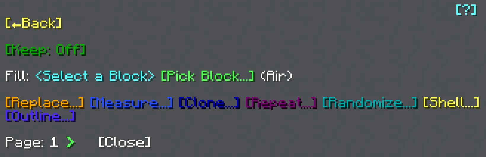
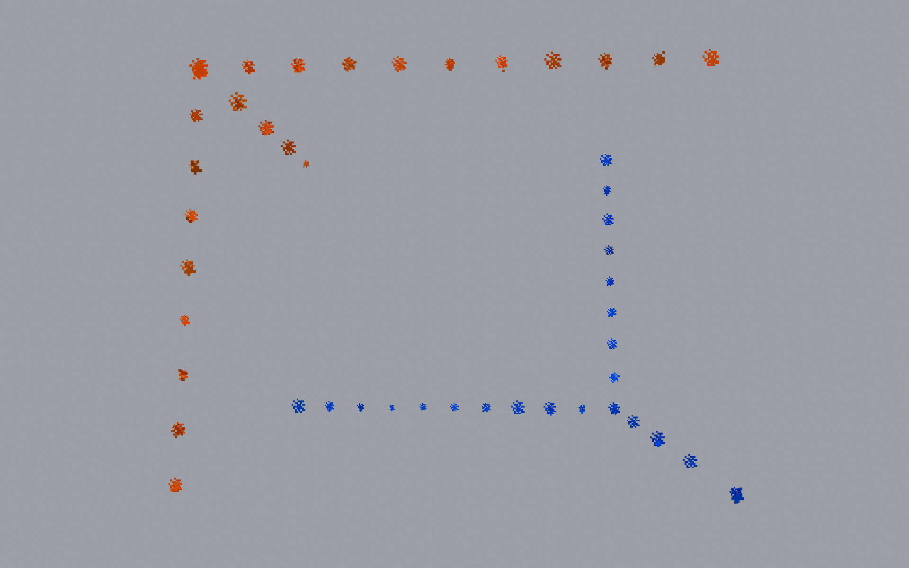

import MCFont from '@site/src/components/minecraft-font'

# Usage

The General Tool (has the item name "Set Position 1" or "Set Position 2") can be used to place a **position 1** and a **position 2** by right-clicking on blocks whilst holding the item in your main hand.

**Drop the tool** to switch the position you place.  

## Initial menu
If both positions have been set, the <MCFont color="green">[Use...]</MCFont> button in this right-click menu should be green.  

You can use the <MCFont color="yellow">[Set Position 1 Here]</MCFont> and <MCFont color="yellow">[Set Position 2 Here]</MCFont> buttons to set either of the positions to your current player position.

:::tip
Since this menu is opened whenever the General Tool is right-clicked, you can **aim into the sky** and right-click to open this menu without having to set a position. Alternatively, you can **sneak and drop the tool** while standing on the ground.
:::

[Click](../chat-menu-system) the <MCFont color="green">[Use...]</MCFont> button to open the General Tool's main menu.

## Main menu

Here in the **main menu** is where you can find all the different **operations** the General Tool can perform.

At the bottom you can flip through 2 pages to find what you're looking for, with the second page containing more specific and niche operations.
#
The <MCFont color="#0aad02">[Keep]</MCFont> option at the top of the menu lets you toggle whether to replace existing blocks. This option generally works with every operation, but there are some exceptions.

## Particles
While in a menu, the selected area is marked with particles (if not disabled). The blue corner marks position 1, while the orange corner marks position 2.
#

