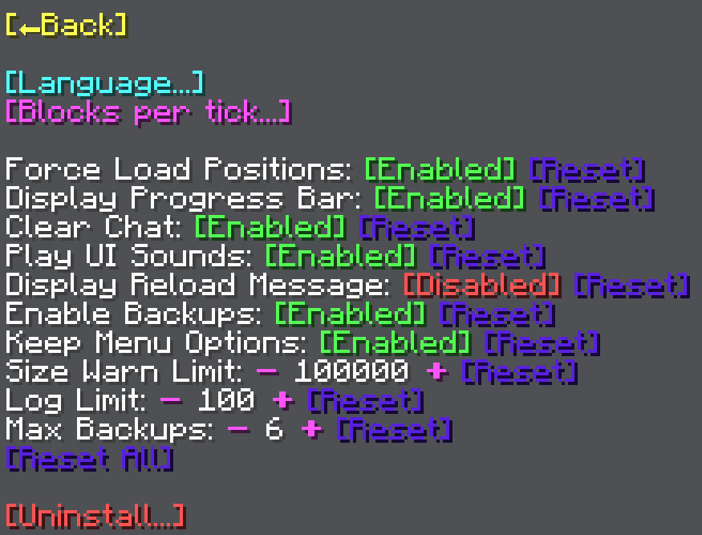

import MCFont from '@site/src/components/minecraft-font'

# Main Menu

From the Settings menu, you can all the global WorldTool settings. These apply for all players using WorldTool.
#

## Main Settings
The main setting list contains the following settings:
* **Force Load Positions** (Default = true) - If enabled, the General Tool's positions 1 and 2, as well as the randomizer positions 1 and 2, will remain loaded even if not within the chunk load distance.
* **Display Progress Bar** (Default = true) - Toggles a progress bar at the top of the screen while a process is running.
* **Clear Chat** (Default = true) - Toggles clearing the chat between each menu to make the UI more readable.
* **Play UI Sounds** (Default = true) - Controls whether to play clicking and popping sounds while navigating the menu.
* **Display Reload Message** (Default = false) - More of a debug tool. If enabled, a message will be displayed every time WorldTool has been reloaded.
* **Enable Backups** (Default = true) - Enables backups and undo functionality. The reason why this is a toggle is because this functionality is still a bit of a beta version.
* **Keep Menu Options** (Default = true) - If enabled, most options set within General Tool menus will be saved when the menus are closed and reopened. This does, however, cause clutter with tags, in case you care about that.
* **Size Warn Limit** (Default = 100000) - A warning will be displayed if an area of this size or greater is selected with the General Tool. This is to prevent accidental area selections.
* **Log Limit** (Default = 100) - The maximum amount of [log entries](../technical/processes#log) to keep.
* **Max Backups** (Default = 6) - The maximum amount of area backups to keep per player. Don't set this value too high, as there is a limit of 1000 total backup slots being used at once.
#
The <MCFont color="#5a20e3">[Reset]</MCFont> buttons next to each option can be used to restore it to its default value.  
The <MCFont color="#5a20e3">[Reset All]</MCFont> button at the bottom of the menu can be used to restore all settings at once to their default values.

## Language
The <MCFont color="aqua">[Language...]</MCFont> button at the top opens a menu that lets you change the language as well as a <MCFont color="yellow">[Reload]</MCFont> option.
#

So far, there is only one language available. You can add a new language yourself by using a [plugin](../making-a-plugin/start), but please let me know if you would like to help translate WorldTool, so I can add it to the base data pack.

## Blocks per Tick

