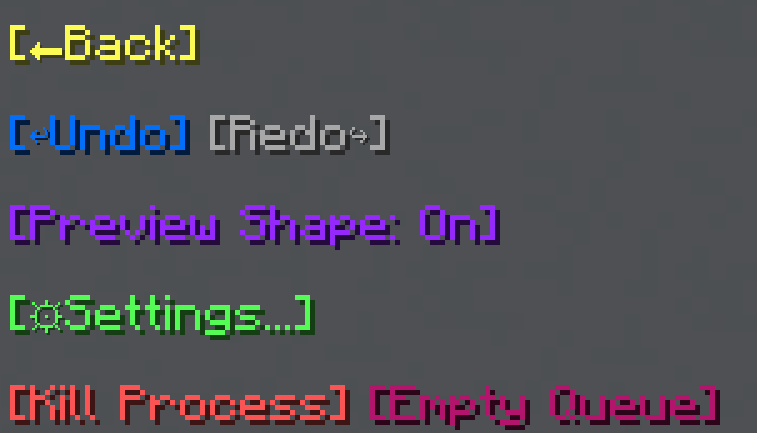

import MCFont from '@site/src/components/minecraft-font'

# Options
The Options menu can be reached with the <MCFont color="aqua">[Options...]</MCFont> button in the [Shape Generation Tool's menu](usage).
#
The Options menu:  

## Undo and Redo

The first features of this menu are the <MCFont color="#036ffc">[↩Undo]</MCFont> and <MCFont color="#7c2bff">[Redo↪]</MCFont> buttons.

Pretty self-explanatorily, these undo or redo the changes you've made using WorldTool's tools.

:::info backups
The backups that are used for the <MCFont color="#036ffc">[↩Undo]</MCFont> and <MCFont color="#7c2bff">[Redo↪]</MCFont> functionality **will be lost** if the data pack is reloaded by either using the `/reload` command or restarting the world.
:::

:::tip
Don't rely on undoing, be careful with your actions.
:::

## Preview Shape

The <MCFont color="#9729ff">[Preview Shape]</MCFont> option toggles whether to show particles to help with generating the shape, and many more things. These particles are **only visible to you**.

## Settings

Main page: [Settings](../configuration).

## Kill Process

The <MCFont color="red">[Kill Process]</MCFont> button kills the currently running [process](../technical/processes), if there is one.

## Empty Queue

The <MCFont color="#b5146d">[Empty Queue]</MCFont> button empties the current [process](../technical/processes) queue. Only use this if something is stuck or went wrong somehow. This does not kill the current process.

To avoid bugginess, it might be a good idea to use the <MCFont color="red">[Kill Process]</MCFont> button after using <MCFont color="#b5146d">[Empty Queue]</MCFont>. 
