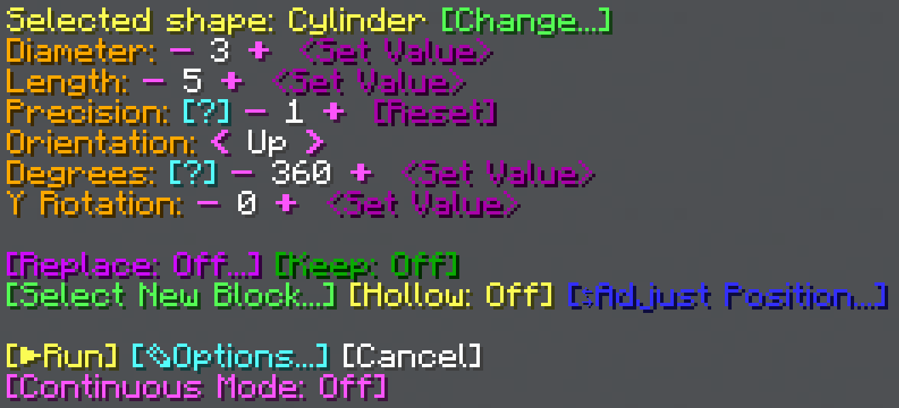

# Usage
The Shape Generation Tool is used for generating 3D structures with one position as a base. Its menu can be opened by either **dropping the tool** or **right-clicking on a block**.
#

The way it looks in the image above is the default state of the menu.
#
To **set a position**, right-click with the tool on a block.
#
By default, the [Cylinder](cylinder) shape is selected. To change the selected shape, use the ­<MCFont color="green">[Change...]</MCFont> button at the top of the menu.

:::tip
All set options and shapes are specific to that Shape Generation Tool item. This means you can make multiple tool items with the options and shapes you need. You can give yourself more shape generation tools with `/loot give @s loot worldtool:shape_tool`, or you can use the **middle mouse button** on shape generation tools in the inventory to make copies of them (while in creative mode).
:::

## Shape Options
What shape options are available depends on the selected shape.
#
* ­<MCFont color="gold">Diameter</MCFont> - The diameter of the shape.
* ­<MCFont color="gold">Length</MCFont> - How long the shape is.
* ­<MCFont color="gold">Precision</MCFont> - How precisely to draw the shape. Shapes are drawn in lines, and this option specifies how tightly the lines are drawn. Higher precision is only useful for bigger shapes.
* ­<MCFont color="gold">Orientation</MCFont> - Which direction the shape faces.
* ­<MCFont color="gold">Degrees</MCFont> - How many degrees of a circle to draw.
* ­<MCFont color="gold">Secondary Degrees</MCFont> - How many degrees of another circle to draw.
* ­<MCFont color="gold">X Rotation</MCFont> - How many degrees to rotate this shape around the X axis. Whether this axis or the Z axis is an available option depends on the set Orientation.
* ­<MCFont color="gold">Y Rotation</MCFont> - How many degrees to rotate this shape around the Y axis.
* ­<MCFont color="gold">Z Rotation</MCFont> - How many degrees to rotate this shape around the Z axis. Whether this axis or the X axis is an available option depends on the set Orientation.

## Replace
Clicking the <MCFont color="#d20aff">[Replace]</MCFont> option button opens a menu that allows you to select either a block to replace (<MCFont color="green">[Normal]</MCFont>) or a block to *not* replace (<MCFont color="gold">[Exclude]</MCFont>). Once Replace has been enabled, you can click the button to disable it again.

## Keep
The <MCFont color="#0aad02">[Keep]</MCFont> option allows toggling of whether to replace existing blocks. When this option is enabled, only blocks such as air and water will be replaced.

## Select Block
­<MCFont color="green">[Select New Block...]</MCFont> opens a menu whcih allows you to view the currently selected block, as well as select a new one with the [block selection menu](../chat-menu-system#block-selection).

## Hollow
The <MCFont color="yellow">[Hollow]</MCFont> option toggles whether the inside of the shape should be left alone or not. If enabled, only the shell of a shape will be generated, which is generally much faster than a filled shape.

## Adjust Position

The Adjust Position menu allows you to nudge the set position.  

At the top of the menu, the current position is displayed.

<MCFont color="gold">[-X]</MCFont><MCFont color="gold">[+X]</MCFont>  
<MCFont color="gold">[-Y]</MCFont><MCFont color="gold">[+Y]</MCFont>  
<MCFont color="gold">[-Z]</MCFont><MCFont color="gold">[+Z]</MCFont>  
Using these buttons moves the position accordingly.

The <MCFont color="aqua">&lt;Set Position&gt;</MCFont> button opens a menu prompt that allows you to manually set the position.

## Options
Main page: [Options](options).

## Continuous Mode
With the <MCFont color="light_purple">[Continuous Mode]</MCFont> option at the very bottom of the menu, you can enable similar functionality to the [Brush Tool](../brush_tool/usage), A.K.A generating a shape wherever you right-click with the tool.

## Preview
While a position is selected (and [particles are on](options#preview-shape)), particles are shown to help preview how the shape will be generated.
#

